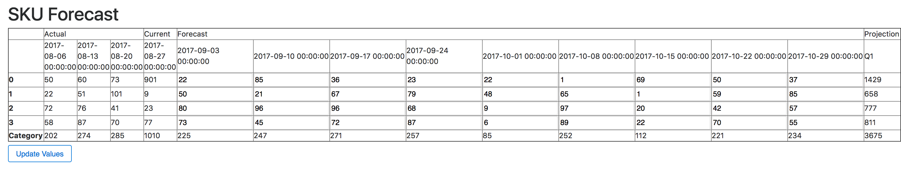

# API coding challenge

---
### Access:

I'm hosting the API from personal server, so to access it go to the address below.

To see the forecast of all products in category2 and category3 type:
  - http://lc30.ddns.net:80/api/v1.0/skus/forecasts?cat=cat2,cat3

To filter based on a select week or range of weeks with certain sku(s) enter those filters:
  - http://lc30.ddns.net:80/api/v1.0/skus/forecasts?wk_range=2017-08-01,2017-10-01&skus=1

To go to the web gui and filter based on categories use this format. Update a forecast by modifying a value in an editable cell and then press 'Update Values'
  - http://lc30.ddns.net:80/api/v1.0/skus/forecasts/table?cat=cat1

---
### Host Locally:

Clone the repo and install the following dependencies on top of a standard Anaconda python 3 environment:


```bash
$ pip install formencode
$ pip install flask
```


To run the app, navigate to the Flask API directory within terminal and type `sudo python v1_api.py`. Then to access the api type 'http://192.168.1.170/' followed by the resource you want to use. *Note* you may need to specify which python using sudo, for example:

```bash
$ sudo /home/$USER/anaconda3/bin/python v1_api.py
```


For example, to see the forecast of all products in category2 and category3 type:
  - http://192.168.1.170/api/v1.0/skus/forecasts?cat=cat2,cat3

To filter based on a select week or range of weeks with certain sku(s) enter those filters:
  - http://192.168.1.170/api/v1.0/skus/forecasts?wk_range=2017-08-01,2017-10-01&skus=1

The results will look like:
  - {"1":{"2017-08-06T00:00:00.000Z":22,"2017-08-13T00:00:00.000Z":51,"2017-08-20T00:00:00.000Z":101,"2017-08-27T00:00:00.000Z":9,"2017-09-03T00:00:00.000Z":50,"2017-09-10T00:00:00.000Z":21,"2017-09-17T00:00:00.000Z":67,"2017-09-24T00:00:00.000Z":79,"2017-10-01T00:00:00.000Z":48}}

To use the HTML version type:
  - http://0.0.0.0/api/v1.0/skus/forecasts/table?cat=cat1
  - Update a forecast by modifying a value in an editable cell and then press 'Update Values'


